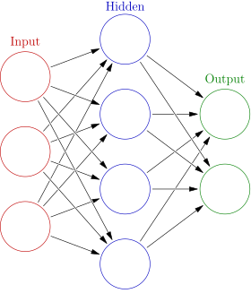

# PyTorch 101

This repository describes in brief the concepts of neural networks and demonstrates the pytorch code for XOR gate.

Happy Learning!

## Let's get started!

Whether you’ve noticed it or not, Deep Learning (DL) plays an important part in all our lives. From the voice assistants and auto-correct services on your smartphone to the automation of large industries, deep learning is the underlying concept behind these meteoric rises in human progress. A major concept that we implement in deep learning is that of neural networks.

## What exactly are Neural Networks?
A neural network is a computing algorithm of an interconnected system of mathematical formulae used to make predictions by “training” the algorithm on data relevant to the prediction to be made. This is partly inspired by the way neurons are connected in biological brains. With the ability to make near life-like predictions of numerical, image and character data, given the appropriate amount of training, neural networks(NNs) have become integral to advancements in the field.

## Creating your own neural network with Pytorch

To create our own DL models with neural networks, we have a number of powerful and easy to use open-source frameworks to make use of, none which is as simple and intuitive as Pytorch, a library in the Python Programming Language.

Pytorch, unlike most other popular frameworks, makes use of dynamic computation, allowing for greater flexibility when building more complex architectures.
The data in Pytorch are in 2 forms:

**Tensors:** these are similar to numpy arrays, which can also be used on GPUs to provide increased performance.

**Variables:** these form a thin wrapper around a tensor object, its gradient and a reference to the function that created it.

Now let’s understand how to use Pytorch by creating our very own XOR gate using Neural Networks.

### Prerequisites:

Before we get into it, there are a few prerequisites.

A basic-level understanding of the Python programming language

Familiarity with Pandas, Numpy and matplotlib

A basic understanding of data science terms and practices is helpful, but not compulsory.

### Importing libraries and metadata:
First we import the relevant libraries we’ll use to create our neural network with pytorch.

    import torch
    from torch.autograd import Variable
    import torch.nn as nn
    import torch.nn.functional as F
    import torch.optim as optim
 
Next we import the libraries we’ll use to load and read the csv file which holds the metadata.

    import numpy as np
    import pandas as pd
    import matplotlib.pyplot as plt
 
We then import the libraries used for the Data Iterator

    from torch.utils.data.dataset import Dataset
    from torchvision.transforms import transforms

Finally, we import the csv file containing the Metadata used to train our network, using the read_csv() function in pandas.

    df = pd.read_csv('TruthTableXOR.csv')[['IN1','IN2','OUT1','OUT2']]
    df.head()

## Creating our own Custom Data Iterator using the Dataset class

Pytorch allows us the flexibility to create our own custom Dataset object with the help of the Dataset class. The Dataset class provides 2 basic functions for this purpose:

The _len_ () function allows us to obtain information on the size of the dataset and the _getitem_ () which, given an index, can return a sample from the dataset, located at the specified location.

    class myData(Dataset):

        def __init__(self,df):

            self.X = [Variable(s) for s in torch.FloatTensor(df[['IN1','IN2']].values)]
            self.y = [Variable(s) for s in torch.FloatTensor(df[['OUT1','OUT2']].values)]

        def __getitem__(self,i):

            return self.X[i],self.y[i]

        def __len__(self):
            return len(self.X)

After defining our class, we can create our class instance and create our torchvision dataset object by loading the dataframe df which contains our metadata which we previously imported using the read_csv() function.

    myDataObject = myData(df)
    Data_loader = torch.utils.data.DataLoader(dataset = myDataObject, batch_size = 1, shuffle = False)

### Defining our Neural Network:

Now it’s finally time to create our neural network! To accomplish this, we create a class XORnet to define our NN.
The neural network we’re gonna create has 1 input layer (2 nodes), 1 hidden layer (3 nodes) and an output layer (2 nodes). We initialize these layers using the _init_() function in our XORnet class. We define the forward() function to define the fully connected network with the ReLU and Sigmoid activation functions for the hidden and output layers respectively.

### Good Question. What are activations?

Activation functions are simply mathematical functions that are used to determine the output of a given node/neuron in a Neural network, whether it’s useful or relevant for the predictions made by the given model.

The Sigmoid function is a type of logistic function which outputs a value between 0 and 1, suitable for a Logical gate like the XOR function. The ReLU (Rectified Linear Unit) function, meanwhile, is a common function used in hidden layers, as it can be used to work around the famous “Vanishing Gradient” problem. It outputs the same value of its input if it is greater than 0 and outputs 0 in all other cases.

[Sigmoid Activation Function plot](./images/sigmoid.png)
[ReLU Activation Function plot](./images/relu.png)

## Define the model class:

    
    def __init__(self):
        
        super(XORnet,self).__init__()
            
        self.linear1 = nn.Linear(in_features = 2, out_features = 3, bias = True)
        self.linear2 = nn.Linear(in_features = 3, out_features = 2, bias = True)
        
    def forward(self,t):
        
        t = self.linear1(t)
        t = F.relu(t)
        
        t = self.linear2(t)
        t = F.sigmoid(t)
        
        return t

We then create our object of the XORnet class, which we’ll call myNet.

    myNet = XORnet()
    myNet

Now before we get to training our Neural network, we need to define the optimizer and the loss function.

### Optimizer and Loss Function

When we train our network, we need to calculate the deviation of the preliminary predictions from the actual values, using which we can train it by adjusting the weights in the nodes using an algorithm called backpropagation. The Backpropagation algorithm, in simple terms, is used to alter the weights of the nodes by feeding the error in prediction in the opposite direction of the feed-forward direction, hence the name Backpropagation. This error or deviation is calculated by the Loss Function. In this example, we use the Mean Squared Error Function to calculate the error. Optimization algorithms like Gradient Descent are used to train the network faster. These functions are used to find parameter values that will maximise or minimise the loss function. We use the Adam optimiser in this case, which is a powerful and popular learning rate optimization function, specifically used for training Neural Networks. We’ve chosen a learning rate of 0.001 for training our model.

    optimizer = torch.optim.Adam(myNet.parameters(), lr=0.001,weight_decay=0.0001)
    criterion = nn.MSELoss()

### Training the Model
It’s finally time to train our Neural Network. We define a function train(), which takes a single parameter n_epochs. An epoch is one full cycle through the entire training dataset. So n_epochs refers to the number of training epochs we’ll use. In each epoch, we iterate through each value in the torchvision dataset we had defined earlier. The loss is calculated and is used to train the network at the end of each epoch via Backpropagation using the backward() function and the optimizer via the step() function.

    def train(n_epochs):

        for i in range(n_epochs):

            eloss = 0 

            for u,(a1,a2)in enumerate(Data_loader):

                print(u,a1,a2)

                optimizer.zero_grad()   # zero the gradient buffers

                output = myNet(a1)
                loss = criterion(output, a2)
                eloss+=loss
                losses.append(loss)
                loss.backward()
                optimizer.step()

            print('Epoch: ',i, 'Loss', eloss/4)
Now, we have the ever-important step of actually starting the training process by calling the train() function. Let’s train our model over 10000 epochs.

### Visualizing our Training losses and Viewing our results: 

Using the plot() function in the matplotlib library, we can plot and visualize our losses in each step of the training process. As we can observe, there is significant flat lining of the error half way through the training function. You can try this with different values of the number epochs as well and compare the results.

[Loss Trends](./images/lossplot.png)

Now for the final result. Has the model made an accurate prediction?

    [myNet(i) for i in myDataObject.X]
    
Output:

    [tensor([0.0225, 0.9775], grad_fn=<SigmoidBackward>),
     tensor([0.9562, 0.0438], grad_fn=<SigmoidBackward>),
     tensor([0.9798, 0.0202], grad_fn=<SigmoidBackward>),
     tensor([0.0228, 0.9772], grad_fn=<SigmoidBackward>)]

At first glance, it might seem like we haven’t really made that good of a prediction, but on closer observation, we can find that the ones made are really close to our expected values to the extent that they are approximately equal. So in other words, the model has made a successful prediction!

### Conclusion:
Congratulations on completing your first neural network using Pytorch! You can try improving the accuracy of your predictions further by modifying and playing with the different parameters used in the functions. This is but a small taste of what Pytorch is capable of. Neural networks using pytorch find a wide array of uses in image recognition, time-series analysis, predictive analysis, image generation and more! Hope this article has given you the curiosity and the drive to take your interest in pytorch forward.
